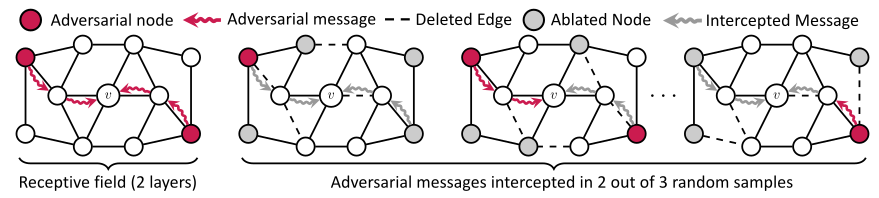

# Randomized Message-Interception Smoothing



Reference implementation of the gray-box certificate proposed in the paper:

**<a href='https://openreview.net/pdf?id=t0VbBTw-o8'>Randomized Message-Interception Smoothing: Gray-box Certificates for Graph Neural Networks</a>**<br>
*Yan Scholten, Jan Schuchardt, Simon Geisler, Aleksandar Bojchevski, Stephan Günnemann*<br>
Conference on Neural Information Processing Systems (NeurIPS), 2022<br>
[ <a href='https://www.cs.cit.tum.de/daml/interception-smoothing/'>Project page</a> | <a href='https://openreview.net/pdf?id=t0VbBTw-o8'>PDF</a> | <a href='https://www.youtube.com/watch?v=rbFiXrh9Snk'>Talk</a> | <a href='https://yascho.github.io/assets/pdf/scholten2022randomized-slides.pdf'>Slides</a> ]

## Example 

We provide a demo notebook (<a href="./demo.ipynb">demo.ipynb</a>) with an example of how to compute certificates for a pretrained GAT model.

## Install

Instructions to install required dependencies:

```
conda env create -f environment.yml 
conda activate interception_smoothing
conda install pytorch torchvision torchaudio cudatoolkit=11.3 -c pytorch
conda install -c conda-forge cudatoolkit-dev
conda install pyg -c pyg
```

The code was tested with Python 3.9.12, pyg 2.0.4, and CUDA 11.4.48 on NVIDIA GeForce GTX 1080 Ti.

## Cite
Please cite our paper if you use this code in your own work:

```
@inproceedings{scholten2022interception_smoothing,
title = {Randomized Message-Interception Smoothing: Gray-box Certificates for Graph Neural Networks},
author = {Scholten, Yan and Schuchardt, Jan and Geisler, Simon and Bojchevski, Aleksandar and G{\"u}nnemann, Stephan},
booktitle={Advances in Neural Information Processing Systems, {NeurIPS}},
year={2023}
}
```

## Contact

For questions and feedback please contact:

Yan Scholten, Technical University of Munich<br>
Jan Schuchardt, Technical University of Munich<br>
Simon Geisler, Technical University of Munich<br>
Aleksandar Bojchevski, CISPA Helmholtz Center for Information Security<br>
Stephan Günnemann, Technical University of Munich

## License

The code by Yan Scholten, Jan Schuchardt, Simon Geisler, Aleksandar Bojchevski and Stephan Günnemann is licensed under MIT license.
